# Сети в Linux

## Part 1. Инструмент ipcalc

- `ipcalc` - это утилита командной строки в Linux, которая используется для вычисления сетевых масок, подсетей, широковещательных адресов и других сетевых характеристик на основе заданного IP-адреса и маски.

**устанавливаем инструмент ipcalc с помощью команды `sudo apt install ipcalc`**

### 1.1. Сети и маски
**1. Адрес сети 192.167.38.54/13**

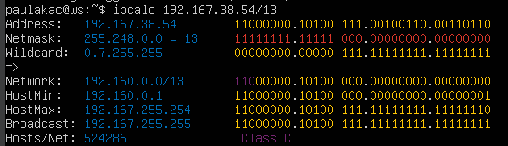 *Адрес сети* 

**2. Перевод маски 255.255.255.0 в префиксную и двоичную запись**

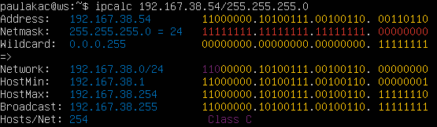 *Перевод маски* 

**/15 в обычную и двоичную**

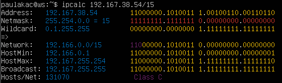 *Перевод маски* 

**11111111.11111111.11111111.11110000 в обычную и префиксную**

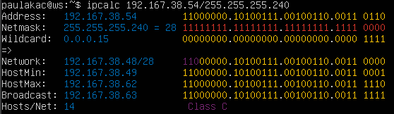 *Перевод маски* 

**3. Минимальный и максимальный хост в сети 12.167.38.4 при масках:**

**/8**

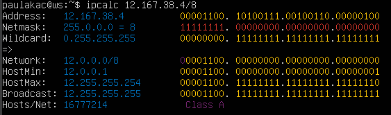 *Хост в сети* 

**11111111.11111111.00000000.00000000**

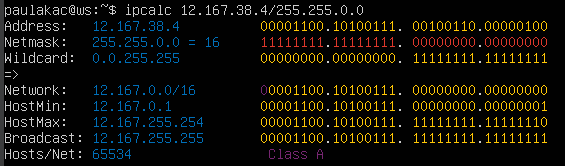 *Хост в сети* 

**255.255.254.0**

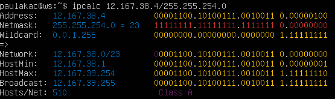 *Хост в сети* 

**/4**

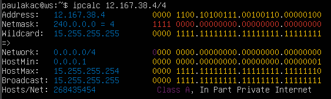 *Хост в сети* 

### 1.2. localhost

#### 1) Определить и записать в отчёт, можно ли обратиться к приложению, работающему на localhost, со следующими IP: 194.34.23.100, 127.0.0.2, 127.1.0.1, 128.0.0.1, для этого пропингуем эти адреса с нашей машины.

- можно обратиться
  - 127.0.0.1
  - 127.0.0.2
    
- нельзя обратиться
  - 194.34.23.100
  - 128.0.0.1

 * 127.0.0.1 — это адрес петлевого интернет-протокола (IP), также называемый [localhost]. Адрес используется для установления IP-соединения с тем же компьютером или компьютером, который используется конечным пользователем. Установление соединения с использованием адреса 127.0.0.1 является наиболее распространенной практикой, при этом использование любого IP-адреса в диапазоне 127. *. *. * будет работать аналогично.

### 1.3. Диапазоны и сегменты сетей.

#### 1) Какие из перечисленных IP можно использовать в качестве публичного, а какие только в качестве частных: 10.0.0.45, 134.43.0.2, 192.168.4.2, 172.20.250.4, 172.0.2.1, 192.172.0.1, 172.68.0.2, 172.16.255.255, 10.10.10.10, 192.169.168.1

- Частный и публичный IP-адреса можно определить по их диапазону.

- В IPv4 есть три диапазона частных IP-адресов:

 - 10.0.0.0 - 10.255.255.255 (диапазон /8)
 - 172.16.0.0 - 172.31.255.255 (диапазон /12)
 - 192.168.0.0 - 192.168.255.255 (диапазон /16)
- Все остальные IP-адреса считаются публичными.

- Также утилита ipcalc показывает нам какого типа является адресс.

- частные адресса
  - 10.0.0.45
  - 192.168.4.2
  - 172.20.250.4
  - 172.16.255.255
  - 10.10.10.10

- публичные адресса
  - 134.43.0.2
  - 172.0.2.1
  - 192.172.0.1
  - 172.68.0.2
  - 192.169.168.1

#### 2) Какие из перечисленных IP адресов шлюза возможны у сети 10.10.0.0/18: 10.0.0.1, 10.10.0.2, 10.10.10.10, 10.10.100.1, 10.10.1.255

- диапозон адресов возможны для данной сети - 10.10.0.1 - 10.10.63.254

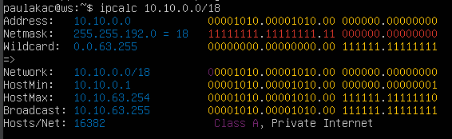 *Диапозон адресов* 

- Исходя из этого для сети 10.10.0.0 возможны следующие адреса:
  - 10.10.0.2
  - 10.10.10.10
  - 10.10.1.255

## Part 2. Статическая маршрутизация между двумя машинами

#### 2.0.1 Поднять две виртуальные машины (далее -- ws1 и ws2)

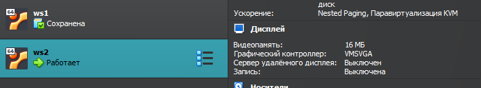 *Виртуальные машины* 

#### 2.0.2 С помощью команды ip a смотрим существующие сетевые интерфейсы

- машина ws1

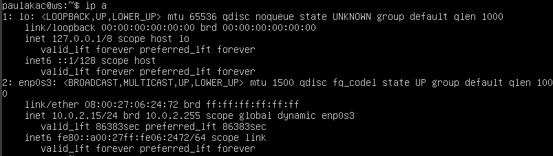 *ip машина ws1* 

- машина ws2

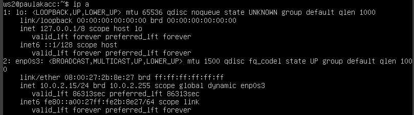 *ip машина ws2* 

#### 2.0.3 Описать сетевой интерфейс, соответствующий внутренней сети, на обеих машинах и задать следующие адреса и маски: ws1 - 192.168.100.10, маска /16, ws2 - 172.24.116.8, маска /12

Сетевой интерфейс, соответствующий внутренней сети, это интерфейс, который подключен к локальной сети внутри организации или домашней сети и предназначен для обмена данными между устройствами в этой сети. Обычно такие интерфейсы имеют адреса из частных IP-диапазонов, например, 192.168.x.x, 172.16.x.x - 172.31.x.x или 10.x.x.x.

В сетевых настройках такой интерфейс может быть настроен для использования DHCP, если адреса присваиваются автоматически, или для использования статических IP-адресов, если адреса присваиваются вручную. Также могут быть настроены другие параметры, такие как маска подсети, шлюз по умолчанию и DNS-серверы.

Кроме того, внутренний интерфейс может иметь дополнительные параметры безопасности, такие как настройки брандмауэра, чтобы защитить локальную сеть от внешних угроз.

- Для открытия файлы конфигурации сетевых интерфейсов используем команду:
`sudo vim /etc/netplan/00-installer-config.yaml`

- машина ws1

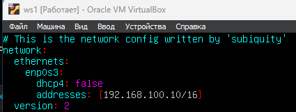 *Сетевой интерфейс машина ws1* 

- машина ws2

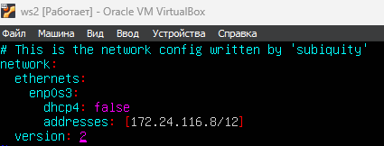 *Сетевой интерфейс машина ws2* 

#### 2.0.4 Выполнить команду netplan apply для перезапуска сервиса сети

- Прописываю комманды для принятие новых настроек конфигурации сети и перезапуска сервиса:
`sudo netplan apply`

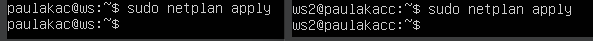 *перезапуск сетевого интерфейс* 

### 2.1. Добавление статического маршрута вручную

#### 2.1.1 Добавить статический маршрут от одной машины до другой и обратно при помощи команды вида ip r add

- Cтатистически задаю маршрут с помощью команды:
`sudo ip r add <target_network> dev <device>`

- машина ws1

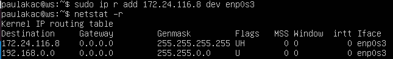 *Статически машина ws1* 

- машина ws2

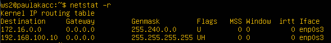 *Статически машина ws2* 

#### 2.1.2 Пропинговать соединение между машинами
- Настройки -> Сеть ->-> включаем адаптер, выбираем NAT network 'zima' у каждой виртуальной машины

- машина ws1

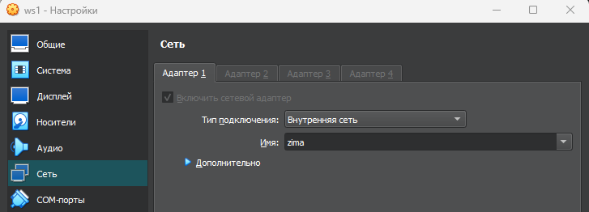 *адаптер сети машина ws1* 

- машина ws2

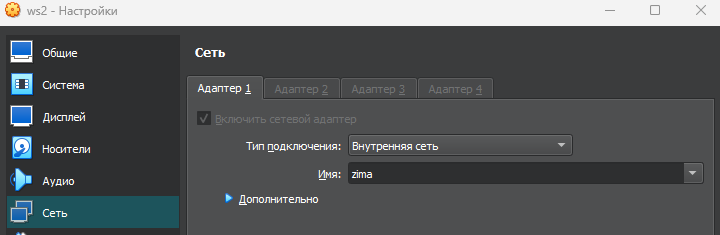 *адаптер сети машина ws2* 

- пропингуем соединения с помощью команды:
`ping -c 3 <target_network>`

- машина ws1

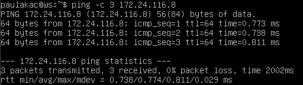 *пинг соединения ws1* 

- машина ws2

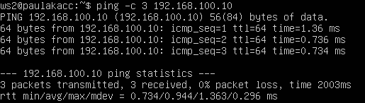 *пинг соединения ws2* 

### 2.2.  Добавление статического маршрута с сохранением

- Добавить статический маршрут от одной машины до другой с помощью файла `etc/netplan/00-installer-config.yaml`

- машина ws1

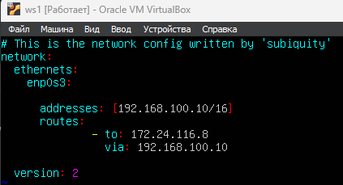 *Статический маршрут для ws1* 

- машина ws2

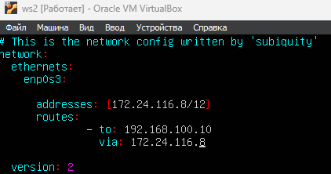 *Статический маршрут для ws2* 

#### 2.2.2 Пропинговать соединение между машинами

- пропингуем соединения с помощью команды:
`ping -w 3 <target_network>`

- машина ws1

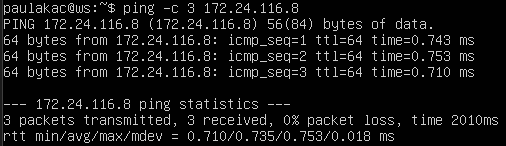 *пинг соединения ws1* 

- машина ws2

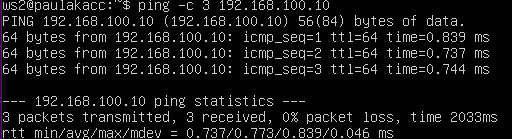 *пинг соединения ws1* 

## Part 3. Утилита iperf3

### 3.1. Скорость соединения

#### Перевести и записать в отчёт: 8 Mbps в MB/s, 100 MB/s в Kbps, 1 Gbps в Mbps

- 8 Mbps == 1 MB/s (8 Мегабит в секунду /8 = 1 Мегабайт в секунду)
- 100 MB/s == 800000 Kbps (100 Мегабайт в секунду *1000 *8 = 800000 Килобит в секунду)
- 1 Gbps == 1000 Mbps (1 Гигабит в секунду *1000 = 1000 Мегабит в секунду)

### 3.2. Скорость соединения

`Iperf3` - это утилита командной строки для измерения пропускной способности сети TCP и UDP. Она используется для проверки скорости передачи данных между двумя узлами в сети. Одна узел работает в качестве сервера, а другой - в качестве клиента. Клиент отправляет данные на сервер, и утилита измеряет скорость передачи данных, задержку и другие параметры.

Чтобы создать сервер испольузется команда:

> `iperf3 -s [option]`

> `-f` - используется для указания формата отображения результатов измерения скорости сетевого соединения (k - кбит, m - мегабит, g - гигабит или K - килобайт, M - мегабайт, G - гигабайт)

> `-D` - запускает сервер в фоновом режиме, что означает, что сервер будет запущен как демон и не будет выводить результаты тестирования на консоль. Это может быть полезно для длительных тестов или в случае, когда требуется тестировать сеть с использованием многих клиентов.

Чтобы запустить **iperf3** в клиентском режиме используем флаг **-с** и указываем адрес хоста, на котором работает сервер.

> `iperf3 -c [host_address] [oprion]`

#### Измерить скорость соединения между ws1 и ws2

Чтобы измерить скорость передачи данных между двумя ВМ создадим на ws1 сервер, а на ws2 клиента.

Создадим сервер на ws1 командой:

`iperf3 -s`

Создадим клиента на ws2, делающего запрос на созданный ранее сервер:

`iperf3 -c 192.168.100.10`

- машина ws1

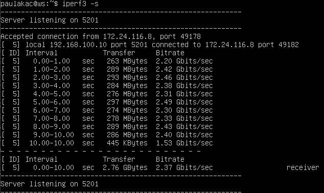 *Создание сервера на ws1* 

- машина ws2

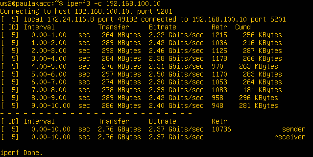 *Создание сервера на ws2* 

Скорость соединения:

- sender: 2.37 Gbits/sec
- receiver: 2.37 Gbits/sec

## Part 4. Сетевой экран

Сетевой экран (firewall) - это программное или аппаратное устройство, которое используется для фильтрации трафика в сети, обеспечения безопасности и защиты от вредоносных атак

### 4.1. Утилита iptables

`iptables` - это утилита командной строки для настройки правил фильтрации сетевого трафика в Linux. Она позволяет создавать правила для блокировки или разрешения доступа к определенным портам, протоколам и IP-адресам.

С помощью iptables можно настроить межсетевой экран (firewall), который будет обеспечивать безопасность сетевого трафика, пропуская только тот трафик, который соответствует заранее заданным правилам.

Общий синтаксис команды iptables выглядит так:

`$ iptables [option] [chain] [rule]`

- A - добавить правило в цепочку;
- С - проверить все правила;
- D - удалить правило;
- I - вставить правило с нужным номером;
- L - вывести все правила в текущей цепочке;
- S - вывести все правила;
- F - очистить все правила;
- N - создать цепочку;
- X - удалить цепочку;
- P - установить действие по умолчанию.

Дополнительные опции для правил:

- p - указать протокол, один из tcp, udp, udplite, icmp, icmpv6,esp, ah, sctp,
  m h;
- s - указать ip адрес устройства-отправителя пакета;
- d - указать ip адрес получателя;
- i - входной сетевой интерфейс;
- o - исходящий сетевой интерфейс;
- j - выбрать действие, если правило подошло.

##### Создать файл /etc/firewall.sh, имитирующий фаерволл, на ws1 и ws2:

Переходим в корневую папку и создаем файл firewall.sh на ws1 и ws2:

`sudo touch /etc/firewall.sh`

Чтобы добавить новые правила испльзуем команду:

`sudo vi /etc/firewall.sh`

#### Нужно добавить в файл подряд следующие правила:

1. На ws1 применить стратегию когда в начале пишется запрещающее правило, а в конце пишется разрешающее правило

2. на ws2 применить стратегию когда в начале пишется разрешающее правило, а в конце пишется запрещающее правило (это касается пунктов 4 и 5)

3. открыть на машинах доступ для порта 22 (ssh) и порта 80 (http)

4. запретить echo reply (машина не должна "пинговаться”, т.е. должна быть блокировка на OUTPUT)

5. разрешить echo reply (машина должна "пинговаться")

- машина ws1

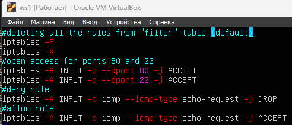  *разрешить echo reply на ws1* 

- машина ws2

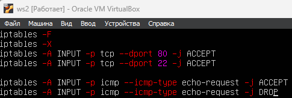 *разрешить echo reply на ws2* 

#### Запустить файлы на обеих машинах командами chmod +x /etc/firewall.sh и /etc/firewall.sh

Также пременим команду для просмотра применных правил:

`sudo iptables -L -nv`

- машина ws1

 *проверка правил на ws1* 

- машина ws2

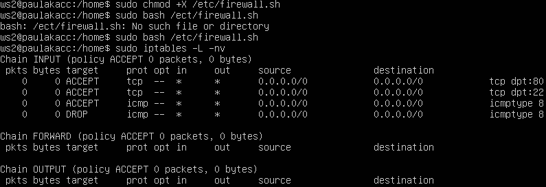 *проверка правил на ws2* 

- Пинг ws2 с ws1

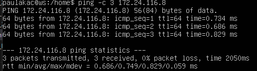 *Пинг ws2 с ws1* 

- Пинг ws1 с ws2

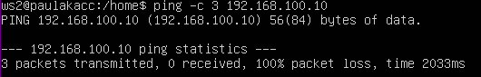 *Пинг ws1 с ws2* 

Разница между стратегиями: для того, чтобы одна машинга пинговалась, а вторая нет, не обязательно писать обе строки, так как правила обрабатываются в порядке их написания. Различие между стратегиями в том, что в утилите iptables правила выполняются сверху вниз, то есть если правило запрета находиться выше оно срабатывает, а правило разрешения находящиеся ниже - нет.

### 4.2. Утилита nmap

#### Командой ping найти машину, которая не "пингуется", после чего утилитой nmap показать, что хост машины запущен.

 *Пинг ws1* 

 *Пинг ws2* 

**Вижу, что машина ws1 с ws2 не пингуется, устанавливаю утилиту nmap и проверяю работу ws1.**

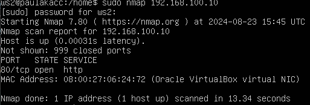 *утилита nmap и проверка работы ws1* 

Как и предполагалось ws1 не може пинговаться с ws2 из за настроек таблицы FILTER в цепи INPUT, которые мы сделали в заданиях выше, в то время как ws1 может пинговать ws2.

## Part 5. Статическая маршрутизация сети

#### Поднять пять виртуальных машин (3 рабочие станции (ws11, ws21, ws22) и 2 роутера (r1, r2))

**Создаем 5 машин и называем их соответсвенно схеме**

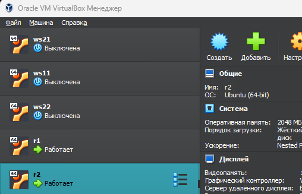 *Мои виртуальные машины* 

### 5.1. Настройка адресов машин

#### Настроить конфигурации машин в /etc/netplan/00-installer-config.yaml согласно сети на рисунке.

**Настраиваем статический ip в соответсвии со схемой для каждой машины:**

- машина ws11

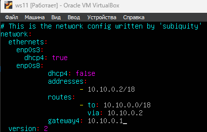 *настройка ws11* 

- машина ws21

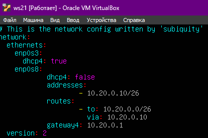 *настройка ws21* 

- машина ws22

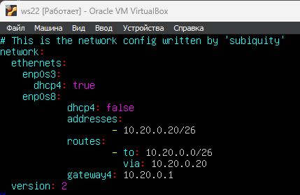 *настройка ws22* 

- машина r1

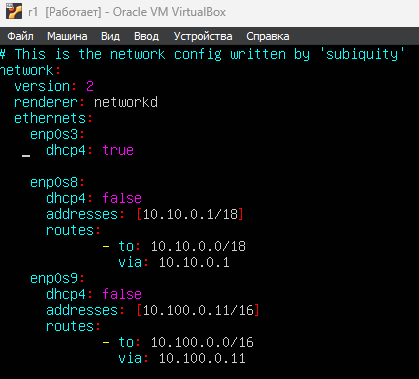 *настройка r1* 

- машина r2

 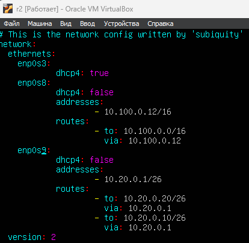 *настройка r2* 

#### Перезапустить сервис сети. Если ошибок нет, то командой ip -4 a проверить, что адрес машины задан верно. Также пропинговать ws22 с ws21. Аналогично пропинговать r1 с ws11.

Перезапускаем сервисы сети с помощью команды:

`sudo netplan apply`

Проверяем адресса сетевых интерфесов машины командой:

`sudo ip -4 a` , где `-4` - вывод только IPv4 адрессов

- машина ws11

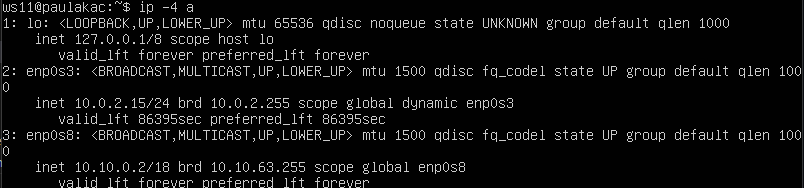 *проверка ip на ws11*  

- машина ws21

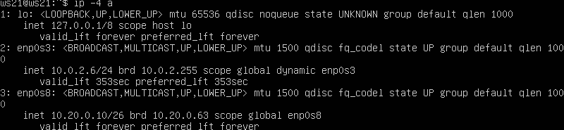 *проверка ip на ws21* 

- машина ws22

 *проверка ip на ws22* 

- машина r1

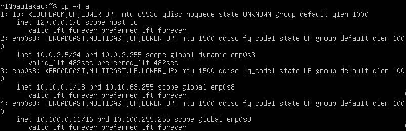 *проверка ip на r1* 

- машина r2

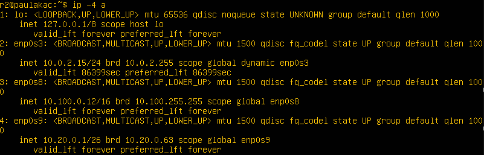 *проверка ip на r2* 

**Все адресса верны. Теперь пропингуем ws22 с ws21:**

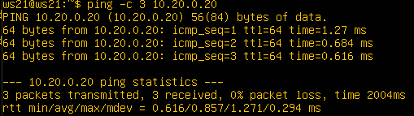 *пинг ws22 с ws21* 

**Также пропингуем r1 с ws11:**

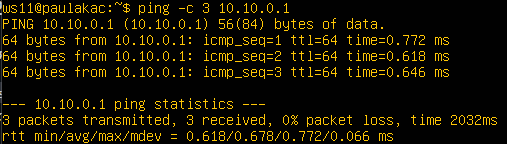 *пинг r1 с ws11* 

### 5.2. Включение переадресации IP-адресов.

#### Для включения переадресации IP, выполните команду на роутерах:

 `sysctl -w net.ipv4.ip_forward=1`
 При таком подходе переадресация не будет работать после перезагрузки системы.

Команда sudo sysctl -w net.ipv4.ip_forward=1 включает пересылку пакетов IP на уровне ядра. Это позволяет маршрутизатору пересылать пакеты между разными подсетями в локальной сети.

- `sysctl` используется для настройки параметров ядра операционной системы.

- `-w` указывает на то, что мы хотим изменить значение параметра.

- `net.ipv4.ip_forward` - это имя параметра, который мы хотим изменить. Он отвечает за пересылку пакетов IP на уровне ядра.

- `1` - это значение, которое мы устанавливаем для параметра, чтобы включить пересылку пакетов IP. Значение 0 отключает эту опцию.

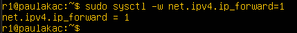 *для r1* 

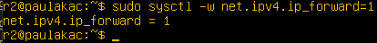 *для r2* 

#### Откройте файл /etc/sysctl.conf и добавьте в него следующую строку:

`net.ipv4.ip_forward = 1`
При использовании этого подхода, IP-переадресация включена на постоянной основе.

- машина r1

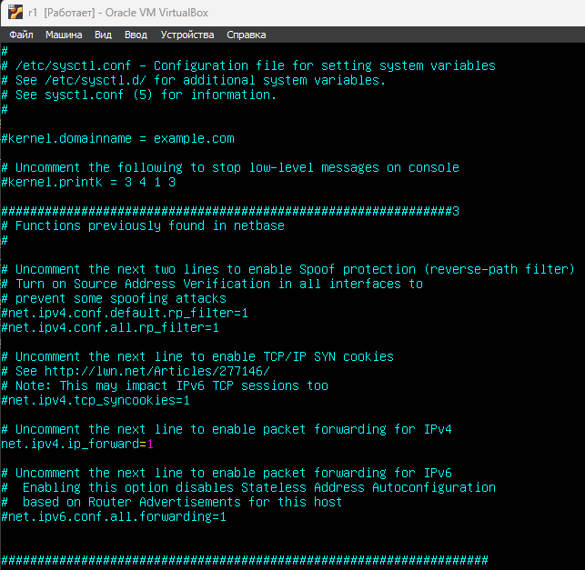 *r1* 

- машина r2

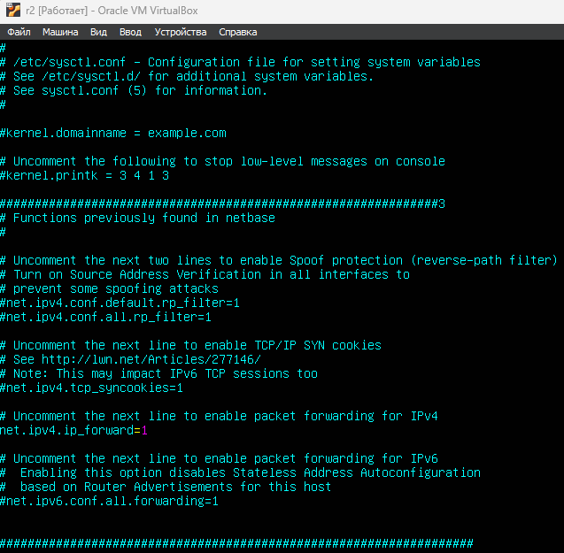 *r2* 

- Перезагружаем и выполняем команду `sysctl net.ipv4.ip_forward` для проверки: 

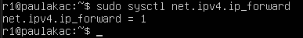 *r1* 

 *r2* 

- Параметр ядра net.ipv4.ip_forward равен 1. Это означает, что переадресация включена.
 

### 5.3. Установка маршрута по-умолчанию

#### Настроить маршрут по-умолчанию (шлюз) для рабочих станций. Для этого добавить default перед IP роутера в файле конфигураций

Настраиваем в конфигурации yaml файла ip роутера наших машин 11 21 22

- машина ws11

 *ws11* 

- машина ws21

 *ws21* 

- машина ws22

 *ws22* 

Применяем изменения в силу:

> `sudo netplan apply`

#### Вызвать ip r и показать, что добавился маршрут в таблицу маршрутизации

Чтобы проверить новый маршрут вызовем таблицу маршрутов командой:

`ip r`

- машина ws11

 *ws11* 

- машина ws21

 *ws21* 

- машина ws22

 *ws22* 

#### Пропинговать с ws11 роутер r2 и показать на r2, что пинг доходит. Для этого использовать команду:

 `tcpdump -tn -i eth1`

Позволяет производить захват сетевого трафика на интерфейсе eth1 в текстовом формате без использования имён хостов и портов. Она предназначена для анализа сетевой активности и может использоваться для отслеживания соединений, поиска узких мест и проблем в сети.

- `-tn`: опция позволяет выводить адреса в числовом формате и пропускать DNS-преобразование имёнхостов;
- `-i` eth1: опция позволяет указать интерфейс, на котором будет производиться захват трафика. Вданном случае захват будет осуществляться на интерфейсе eth1.

Если пропинговать r2 с ws11 то ответ с него не вернется, так как на нем не настроена маршрутизация пакетов. Однако исользуя комадну `tcpdump -tn -i eth1` на r2 мы можем увидеть что все таки сигнал проходит.

Для этого запускаем эту команду на r2 и в этот момент начинаем пинговать с ws11 r2. По итогу на r2 мы увидим что сигнал от ws11 проходит, но не возвращается назад на ws11.

- Пингуем с ws11 машины на r2

 *пинг с ws11 машины на r2* 

- Видим что сигнал от ws11 проходит на r2

 *сигнал от ws11 проходит на r2* 

### 5.4. Добавление статических маршрутов

#### Добавить в роутеры r1 и r2 статические маршруты в файле конфигураций. Пример для r1 маршрута в сетку 10.20.0.0/26:

Чтобы роутеры знали, на какой роутер отправлять данные с полученным ip настроим статические маршрут. Для этого требуется внести изменения в yaml файл.

- yaml файлы r1

 *yaml r1* 

- yaml файлы r2

 *yaml r2* 

Применим изменения командой:

> `sudo netplan apply`

#### Вызвать ip r и показать таблицы с маршрутами на обоих роутерах. Пример таблицы на r1 и на r2:

 *ip r на машине r1* 

 *ip r на машине r2* 

#### Запустить команды на ws11:

ip r list 10.10.0.0/[маска сети] и ip r list 0.0.0.0/0

 *ip r list на машине ws11* 

Поскольку ws11 находится внутри сети 10.10.0.0/18, то для связи с ней она использует свой собственный ip. Однако, чтобы связаться с другими сетями, ws11 использует маршрут по умолчанию и отправляет данные на роутер, чтобы тот доставил их в нужную сеть. Вариант использования IP-адреса 0.0.0.0 в качестве статического маршрута по умолчанию означает, что в таблице маршрутизации не указан конкретный адрес в качестве следующего перехода на пути пакета к его конечному получателю. Когда маршрут по умолчанию используется с маской подсети 0.0.0.0, он соответствует любому адресу.

### 5.5. Построение списка маршрутизаторов

Команда `traceroute` отправит серию пакетов с увеличивающимися значениями TTL (Time To Live) и отследит время их прохождения через промежуточные узлы маршрутизации. Это позволяет определить, через какие узлы проходит путь до указанного назначения и сколько времени занимает доставка пакетов до каждого из узлов.

#### Запустить на r1 команду дампа:

`tcpdump -tnv -i eth0`

Команда `tcpdump -tnv -i eth0` запускает утилиту `tcpdump` для захвата сетевого трафика на интерфейсе eth0 в текстовом формате.

`-t` - отключает вывод временной метки

`-n` - отключает вывод имени хоста (или ip-адреса, если опция -n применяется и для анализа IP-адресов)

`-v` - увеличивает уровень детализации вывода

`-i` eth0 - задает интерфейс eth0, на котором будет происходить захват

Запускаем дамп на r1:

 *дамп на r1* 

#### При помощи утилиты traceroute построить список маршрутизаторов на пути от ws11 до ws21

пингуем с 11 на 21:
 *пингуем с 11 на 21* 

перехватываем трафик на r1:
 *трафик на r1* 

Traceroute использует принцип увеличения значения поля TTL (Time To Live) в сетевых пакетах для определения маршрута до указанного назначения. Вот основной принцип работы команды traceroute:

- Команда traceroute отправляет серию пакетов с низким значением TTL (обычно 1) к указанномназначению (например, IP-адрес или доменное имя).

- Когда пакет с низким значением TTL попадает на маршрутизатор (или другой узел) по путизначение TTL уменьшается на 1. Если значение TTL достигает нуля, пакет считается истекшим маршрутизатор отправляет обратно сообщение "Time Exceeded" (время истекло) обратно отправителю.

- Команда traceroute записывает адрес каждого промежуточного узла, от которого полученсообщение "Time Exceeded", и время, затраченное на доставку пакета до этого узла.

- Для следующего пакета команда traceroute увеличивает значение TTL на 1 и отправляет его снова. Это делается для определения следующего узла на маршруте.

- Процесс повторяется, пока пакеты не достигнут указанного назначения или не превысямаксимальное количество прыжков (указанное в команде traceroute).

- В итоге команда traceroute выводит список адресов промежуточных узлов и время задержки ping до каждого узла на пути до указанного назначения.

- Каждый пакет проходит на своем пути определенное количество узлов, пока достигнет своей цели. Причем, каждый пакет имеет свое время жизни. Это количество узлов, которые может пройти пакет перед тем, как он будет уничтожен. Этот параметр записывается в заголовке TTL, каждый маршрутизатор, через который будет проходить пакет уменьшает его на единицу. При TTL=0 пакет уничтожается, а отправителю отсылается сообщение Time Exceeded. Команда traceroute linux использует UDP пакеты. Она отправляет пакет с TTL=1 и смотрит адрес ответившего узла, дальше TTL=2, TTL=3 и так пока не достигнет цели. Каждый раз отправляется по три пакета и для каждого из них измеряется время прохождения. Пакет отправляется на случайный порт, который, скорее всего, не занят. Когда утилита traceroute получает сообщение от целевого узла о том, что порт недоступен трассировка считается завершенной.

### 5.6. Использование протокола ICMP при маршрутизации

`ICMP (Internet Control Message Protocol)` - это протокол, используемый для передачи сообщений об ошибках и управляющих сообщений в сетях IP. ICMP обычно используется для тестирования сети и диагностики соединений. Он работает на уровне интернета (IP) и использует специальные сообщения, называемые ICMP-сообщениями, для передачи информации между устройствами в сети.

#### Запустить на r1 перехват сетевого трафика, проходящего через eth0 с помощью команды:

`sudo tcpdump -n -i eth0 icmp`

 *на r1 перехват сетевого трафика* 

#### Пропинговать с ws11 несуществующий IP (например, 10.30.0.111) с помощью команды:

 `ping -c 1 10.30.0.111`

 *пинг с ws11 несуществующий IP* 

## Part 6. Динамическая настройка IP с помощью DHCP

`DHCP (Dynamic Host Configuration Protocol)` - это протокол сетевого уровня, который позволяет автоматически назначать IP-адреса и другую сетевую конфигурацию устройствам в сети. DHCP позволяет избежать необходимости вручную настраивать каждое устройство в сети и упрощает администрирование сети.

Для использования возможностей DHCP внутри нашей локальной сети, нам необходимо установится `DHCP-сервер` или `dhcpd`.

> `dhcpd` - это программа, которая представляет собой сервер DHCP, используемый для автоматической настройки сетевых параметров устройств, подключенных к сети.

Для его установки используем команду:

> `sudo apt-get install isc-dhcp-server`

`ISC-DHCP (Internet Systems Consortium Dynamic Host Configuration Protocol)` — это реализация DHCP-сервера, разработанная Internet Systems Consortium. DHCP (Dynamic Host Configuration Protocol) - это протокол, используемый для автоматической настройки сетевых настроек компьютеров и других устройств в сети, таких как IP-адреса, маски подсети, шлюзы по умолчанию, DNS-серверы и т.д. Он предоставляет инструменты для настройки и управления DHCP-сервером на Linux-системах.

#### Для r2 настроить в файле /etc/dhcp/dhcpd.conf конфигурацию службы DHCP:

1. указать адрес маршрутизатора по-умолчанию, DNS-сервер и адрес внутренней сети. Пример файла для r2:

Входим в режим редактирования файла `sudo vim /etc/dhcp/dhcpd.conf` и вносим изменения:

 *редактирование dhcpd.conf* 

2. в файле resolv.conf прописать nameserver 8.8.8.8.
`sudo vim /etc/resolv.conf`

 *редактирование resolv.conf* 

#### Перезагрузить службу DHCP командой systemctl restart isc-dhcp-server. Машину ws21 перезагрузить при помощи reboot и через ip a показать, что она получила адрес. Также пропинговать ws22 с ws21.

Перезагрузим DHCP комадной:

`sudo systemctl restart isc-dhcp-server`

 *Перезагрузка DHCP* 

На машинах ws21 и ws22 сделаем DHCP-протокол аткивным и принимаем новые настройски netplan:

 *ws21* 

 *ws22* 

Для перезапуска операционной системы используем на обоих машинах команду:

`sudo systemctl reboot`

Смотрим ip a

- ws21

 *ws21* 

- ws22

 *ws22* 

Пропингуем ws22 с ws21 по выделенному ip:

`ping -c 3 10.20.0.2`

 *пинг ws22 с ws21* 

#### Указать MAC адрес у ws11, для этого в etc/netplan/00-installer-config.yaml надо добавить строки: macaddress: 10:10:10:10:10:BA, dhcp4: true

Заходим в yaml файл и добавляем туда новый MAC-адрес и активируем DHCP-протокол:

 *ws11* 

#### Для r1 настроить аналогично r2, но сделать выдачу адресов с жесткой привязкой к MAC-адресу (ws11). Провести аналогичные тесты

На r1 нужно также установить dhcpd и отредактировать его с жесткой привязкой к MAC-адресу хоста (ws11). Это значит что конкретный ip внутри одной локальной сети будет всегда принадлежать устройству с конкретны MAC-адресом.

Редактируем файл `sudo vim /etc/dhcp/dhcpd.conf` на r1

 *dhcpd.conf на r1* 

и в файле resolv.conf прописать nameserver 8.8.8.8.

 *resolv.conf на r1* 

Через 'ip a' показываем, что ws11 получила адрес:

 *'ip a' для ws11* 

#### Запросить с ws21 обновление ip адреса

Чтобы запросить обновление ip адреса на для ws21 сперва используем команду для удаления старого адреса:

`sudo dhclient -r`

 *удаления старого адреса ip* 

Теперь используем команду для назначения нового адреса:

`sudo dhclient -v`

 *назначение нового адреса ip* 

### В отчёте описать, какими опциями DHCP сервера пользовались в данном пункте.

В данному пункте были использованы такие опции DHCP как:

- Настройка конфигурации службы DHCP (адрес маршрутизатора по-умолчанию, DNS-сервер, адрес внутренней сети, привязка к MAC-адресу)
- Клиент протокола динамической конфигурации хоста (команда dhclient) для обновления или освобождения IP-адреса

## Part 7. NAT

#### В файле /etc/apache2/ports.conf на ws22 и r1 изменить строку Listen 80 на Listen 0.0.0.0:80, то есть сделать сервер Apache2 общедоступным

`Apache2` - это это свободный веб-сервер, который позволяет создавать и хостить веб-сайты и веб-приложения.

Для начала нам необходимо установить программу apache2 на наши виртуальные машины:

> `sudo apt-get install apache2`

`Listen 80` означает, что сервер будет слушать все доступные IP-адреса на порту 80. Таким образом, сервер будет слушать запросы на порту 80 как с локального хоста, так и с других устройств, если они будут иметь доступ к серверу.

`Listen 0.0.0.0:80` означает тоже самое, но явно указывает, что сервер должен слушать все доступные IP-адреса.

Изменяем этот параметр в файле `/etc/apache2/ports.conf`

- в ws22

 *изменение ports.conf для ws22* 

- в r1

 *изменения для r1* 

#### Запустить веб-сервер Apache командой service apache2 start на ws22 и r1

`service apache2 start`

проверить статус `service apache2 status`

- в ws22

 *статус service apache2 для ws22* 

- в r1

 *статус service apache2 для r1* 

#### Добавить в фаервол, созданный по аналогии с фаерволом из Части 4, на r2 следующие правила:

Создаем файл firewall.sh:

`sudo vi /etc/firewall.sh`

Вносим туда слудующие команды:

1. удаление правил в таблице filter - iptables -F

2. удаление правил в таблице "NAT" - iptables -F -t nat

3. отбрасывать все маршрутизируемые пакеты - iptables --policy FORWARD DROP

 *firewall.sh для r2* 

Даем права этому файлу и запускаем его:

` sudo chmod +x /etc/firewall.sh | bash /etc/firewall.sh`

 *права и запуск firewall.sh для r2* 

#### Проверить соединение между ws22 и r1 командой ping

<i>При запуске файла с этими правилами, ws22 не должна "пинговаться" с r1</i>

Так как мы запретили форвард пакетов на r2, то r1 не может пинговать ws22:

 *пакеты не проходят* 

#### Добавить в файл ещё одно правило:

4. разрешить маршрутизацию всех пакетов протокола ICMP

Чтобы разрешить маршрутизацию всех пакетов протокола ICMP с помощью iptables, необходимо выполнить следующую команду:

 `iptables -A FORWARD -p icmp -j ACCEPT`

 *редактирование firewall.sh для r2* 

Применяем новые правила и проверяем таблицу правил:

 *права и запуск firewall.sh* 

#### Проверить соединение между ws22 и r1 командой ping

Теперь пинг проходит

 *после пинг проходит* 

#### Добавить в файл ещё два правила:

5. включить SNAT, а именно маскирование всех локальных ip из локальной сети, находящейся за r2 (по обозначениям из Части 5 - сеть 10.20.0.0)

6. включить DNAT на 8080 порт машины r2 и добавить к веб-серверу Apache, запущенному на ws22, доступ извне сети

`SNAT (Source Network Address Translation) и DNAT (Destination Network Address Translation)` - это два типа трансляции IP-адресов, используемых для изменения адресов источника и назначения в IP-пакетах при прохождении через маршрутизатор.

`SNAT` используется для изменения IP-адреса источника, когда пакет покидает локальную сеть и направляется во внешнюю сеть. Это позволяет скрыть реальный IP-адрес отправителя и использовать общедоступный IP-адрес маршрутизатора в качестве источника пакета.

`DNAT` используется для изменения IP-адреса назначения, когда пакет приходит во входящий интерфейс маршрутизатора. Это позволяет перенаправить трафик на другой IP-адрес в локальной сети, скрыть реальный IP-адрес получателя или разрешить доступ к локальным ресурсам из внешней сети.

 *редактирование firewall.sh для r2* 

Принимаем новые правила:

`sudo chmid +x /etc/firewall.sh`

`sudo bash /etc/firewall.sh`

#### Проверить соединение по TCP для SNAT, для этого с ws22 подключиться к серверу Apache на r1 командой:

`telnet [адрес] [порт]`

- Telnet - это протокол прикладного уровня, использующийся для удаленного управления устройствами через интернет или локальную сеть. С помощью Telnet можно подключаться к серверам, обычно по протоколу TCP, и взаимодействовать с ними, отправляя команды и получая ответы.

Подключаемся к серверу apache установленному на r1 с ws22:

`telnet 10.100.0.11 80`

 *telnet 10.100.0.11 80 с ws22* 

#### Проверить соединение по TCP для DNAT, для этого с r1 подключиться к серверу Apache на ws22 командой telnet (обращаться по адресу r2 и порту 8080)
пше 
Для этого обратимся по ip, который мы перехватили с помощью tcpdump:

`telnet 10.100.0.12 8080`

 *telnet 10.100.0.12 8080 с r1* 

## Part 8. Дополнительно. Знакомство с SSH Tunnels

Запускаем фаерволы из предыдущих заданий:

 *запуск firewall.sh с r2* 

#### Запустить веб-сервер Apache на ws22 только на localhost (то есть в файле /etc/apache2/ports.conf изменить строку Listen 80 на Listen localhost:80)

Изменяем listen  в файле /etc/apache2/ports.conf и запускаем сервер apache:

 *Изменяем listen* 

 *Запустить веб-сервер Apache* 

#### Воспользоваться Local TCP forwarding с ws21 до ws22, чтобы получить доступ к веб-серверу на ws22 с ws21

`Local TCP forwarding` (также известен как локальное перенаправление портов) - это метод использования SSH для перенаправления трафика между клиентской машиной и сервером SSH. Этот метод позволяет клиентской машине использовать SSH-соединение как "прокси-сервер" для обращения к удаленным ресурсам.`

В нашем случае, мы можем использовать Local TCP forwarding для перенаправления трафика с порта 8080 на ws21 на порт 80 на ws22. Для этого нужно выполнить следующую команду на ws21:

`ssh -L 8080:ws22:80 ws22@10.20.0.20`

 *Local TCP* 

#### Воспользоваться Remote TCP forwarding c ws11 до ws22, чтобы получить доступ к веб-серверу на ws22 с ws11

Чтобы это сделать нужно воспользоваться командой `ssh -R`, которая позволяет соедениться со сторонним хостом.

 *Remote TCP* 

Для проверки, сработало ли подключение в обоих предыдущих пунктах, перейдем во второй терминал клавишами Alt + F2 и выполним команду: `telnet 127.0.0.1 80`

 *проверка telnet 127.0.0.1 80с ws11* 

 *проверка telnet 127.0.0.1 80 с ws21* 

Подключение есть.
