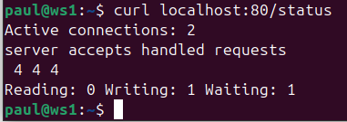
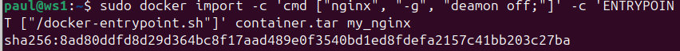
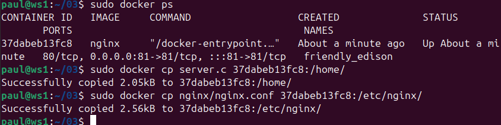
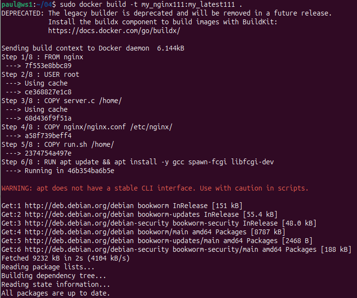
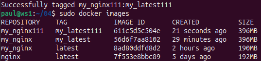

## Part 1. Готовый докер

##### Взять официальный докер образ с **nginx** и выкачать его при помощи `docker pull`

- Устанавливаю сам docker `sudo apt install docker.io`
- Выкачиваю образ nginx `sudo docker pull nginx` 

##### Проверить наличие докер образа через `docker images`

- Проверяю наличие образа `sudo docker images` 

##### Запустить докер образ через `sudo docker run -d [image_id|repository]`
##### Проверить, что образ запустился через `sudo docker ps`

- Запускаю докер образ `sudo docker run -d nginx` и проверяю что он запущен `sudo docker ps`

##### Посмотреть информацию о контейнере через `docker inspect [container_id|container_name]`

- Просматриваю информацию о контейнере `sudo docker inspect ...`

##### По выводу команды определить и поместить в отчёт размер контейнера, список замапленных портов и ip контейнера

- Просматриваю информацию о возможных командах `docker inspect --help`

- Размер контейнера 

Размер контейнера:
* Общий размер всех файлов в контейнере - SizeRootFs
* Размер файлаов, которые подверглись изменению, по сравнению с его прошлым образом - SizeRw

- Список замапленых портов 

- ip контейнера 

##### Остановить докер образ через `docker stop [container_id|container_name]`
##### Проверить, что образ остановился через `docker ps`

- Останавливаю докер образ `sudo docker stop ...` и проверяю что он остановился

##### Запустить докер с портами 80 и 443 в контейнере, замапленными на такие же порты на локальной машине, через команду *run*

- Запускаю докер с портами 80 и 443 `sudo docker run -d -p 80:80 -p 443:443 nginx`

##### Проверить, что в браузере по адресу *localhost:80* доступна стартовая страница **nginx**

- Проверяю что стартовая страница nginx доступна.

##### Перезапустить докер контейнер через `docker restart [container_id|container_name]`
##### Проверить любым способом, что контейнер запустился

- Перезапускаю контейнер и проверяю что перезапустился

## Part 2. Операции с контейнером

##### Прочитать конфигурационный файл *nginx.conf* внутри докер контейнера через команду *exec*

- Командой `sudo docker -it exec ... cat /etc/nginx/nginx.conf` просматриваю файл конфигурации.

##### Создать на локальной машине файл *nginx.conf*
##### Настроить в нем по пути */status* отдачу страницы статуса сервера **nginx**

- Создаю файл nginx.conf, за основу взят имеющийся файл и добавляю отдачу статуса сервера nginx

##### Скопировать созданный файл *nginx.conf* внутрь докер образа через команду `docker cp`
##### Перезапустить **nginx** внутри докер образа через команду *exec*

- Копирую файл nginx.conf внутрь докера `sudo docker cp nginx.conf 1125978e8abf:etc/nginx/` и перезапускаю nginx `sudo docker exec 1125978e8abf nginx -s reload` 

##### Проверить, что по адресу *localhost:80/status* отдается страничка со статусом сервера **nginx**

##### Экспортировать контейнер в файл *container.tar* через команду *export*
##### Остановить контейнер
##### Удалить образ через `docker rmi [image_id|repository]`, не удаляя перед этим контейнеры

- Экспортирую контейнер `sudo docker export 1125978e8abf > container.tar`, останавливаю контейнер `sudo docker stop 1125978e8abf` и удаляю образ nginx `sudo docker rmi nginx -f` 

##### Удалить остановленный контейнер

- Удаляю остановленный контейнер `sudo docker `

##### Импортировать контейнер обратно через команду *import*

- Импортирую мой контейнер

##### Запустить импортированный контейнер

- Запукаю мой контейнер 

##### Проверить, что по адресу *localhost:80/status* отдается страничка со статусом сервера **nginx**

- Проверяю что есть страничка со статусом сервера

* `Active connections` – Количество всех открытых соединений. Это не количество пользователей, которые подключились к сайту, один пользователь для одного просмотра страницы может открыть множество одновременных соединений к серверу.
* `Server accepts handled requests` – Этот параметр показывает, три значения:
* Первый — это количество всех принятых соединений.
* Второй — это количество всех прерванных соединений. Обычно первые 2 значения одинаковы.
* Третий — это количество обрабатывающихся запросов (как правило, данный параметр больше чем второе значение).
* Reading – Количество считанных заголовков запроса в nginx.
* Writing – Nginx читает тело запроса, обрабатывает запрос, или пишет ответ на клиента.
* Waiting – Keep-Alive соединения, на самом деле активно  – (чтение + запись). Эта величина зависит от keepalive-timeout. Это значение можно проигнорировать. 

## Part 3. Мини веб-сервер

##### Написать мини сервер на **C** и **FastCgi**, который будет возвращать простейшую страничку с надписью `Hello World!`

- Создаю файл server.c который будет возвращать надпись `Hello World!` 

##### Написать свой *nginx.conf*, который будет проксировать все запросы с 81 порта на *127.0.0.1:8080*

- Задаю конфигурацию файла nginx.conf 

##### Запустить написанный мини сервер через *spawn-fcgi* на порту 8080

- Для запуска моего сервера делаю следующие шаги: 
- - Запускаю контейнер **nginx** c 81 портом

- - копирую в контейнер **server.c** и **nginix.conf** 

- - Захожу в контейнер и проверяю что файлы перенесены 

- - Обновляю и устанавливаю **gcc**, **spawn-fcgi** и **libfcgi-dev** 

- - Компилирую `gcc server.c -lfcgi` и запускаю сервер `spawn-fcgi -p 8080 ./a.out`, перезагружаю контейнер  

##### Проверить, что в браузере по *localhost:81* отдается написанная вами страничка

- - Проверяю что всё работает

## Part 4. Свой докер

#### Написать свой докер образ, который:
##### 1) собирает исходники мини сервера на FastCgi из [Части 3](#part-3-мини-веб-сервер)
##### 2) запускает его на 8080 порту
##### 3) копирует внутрь образа написанный *./nginx/nginx.conf*
##### 4) запускает **nginx**.

- Создаю свой Dockerfile 

##### Собрать написанный докер образ через `docker build` при этом указав имя и тег

- Собираю свой докер 

##### Проверить через `docker images`, что все собралось корректно

- Проверяю что сборка успешна 

##### Запустить собранный докер образ с маппингом 81 порта на 80 на локальной машине и маппингом папки *./nginx* внутрь контейнера по адресу, где лежат конфигурационные файлы **nginx**'а (см. [Часть 2](#part-2-операции-с-контейнером))

- Запускаю 

##### Проверить, что по localhost:80 доступна страничка написанного мини сервера

- Смотрю что по localhost доступна страничка с сервером 

##### Дописать в *./nginx/nginx.conf* проксирование странички */status*, по которой надо отдавать статус сервера **nginx**

- Дописываю конфиг по которому будет отображаться статус 

##### Перезапустить докер образ

- Захожу в контейнер и перезапускаю его 

##### Проверить, что теперь по *localhost:80/status* отдается страничка со статусом **nginx**

-  Проверяю что по localhost:80/status отображается страничка со статусом 

## Part 5. **Dockle**

-  Скачиваю и устанавливаю Dockle 

##### Просканировать образ из предыдущего задания через `dockle [image_id|repository]`

- Запускаю утилиту dockle 

##### Исправить образ так, чтобы при проверке через **dockle** не было ошибок и предупреждений

- Дополняю свой docker исправляя ошибки Fatal и Warning 

- Снова запускаю dockle и остались только Info 

## Part 6. Базовый **Docker Compose**

##### Написать файл *docker-compose.yml*, с помощью которого:
##### 1) Поднять докер контейнер из [Части 5](#part-5-инструмент-dockle) _(он должен работать в локальной сети, т.е. не нужно использовать инструкцию **EXPOSE** и мапить порты на локальную машину)_
##### 2) Поднять докер контейнер с **nginx**, который будет проксировать все запросы с 8080 порта на 81 порт первого контейнера

- Создаю файл **docker-composee.yml** 

##### Замапить 8080 порт второго контейнера на 80 порт локальной машины

- Меняю файл конфигурации 

##### Остановить все запущенные контейнеры

- Смотрю что запущенных контейнеров нет 

##### Собрать и запустить проект с помощью команд `docker-compose build` и `docker-compose up`

- Командой `docker-compose build` собираются образы и командой `docker-compose up` запускаются контейнеры 

##### Проверить, что в браузере по *localhost:80* отдается написанная вами страничка, как и ранее

- Всё работает 

- В логах виден запрос, который мы отправили из браузера 
