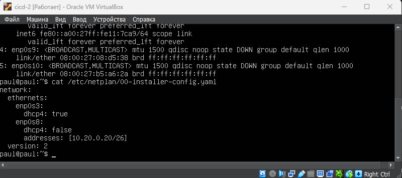
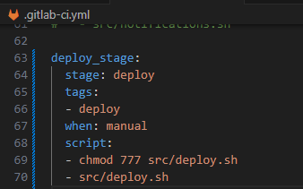

# Basic CI/CD

## Part 1. Настройка gitlab-runner

##### Поднять виртуальную машину *Ubuntu Server 22.04 LTS*
##### Скачать и установить на виртуальную машину **gitlab-runner**
- Поднимем виртуальную машину Ubuntu Server 22.04 LTS:
    - если нужно обновить до нужной версии выполним следующие команды 
        - lsb_release –a - узнать версию
        - sudo apt update
        - sudo apt upgrade
        - sudo apt dist-upgrade
        - sudo do-release-upgrade
        - и ждем, соглашаемся (ставим Y).
        - lsb_release –a - проверяем версию 
    

- Скачивание на виртуальную машину gitlab-runner 
   - curl -L "https://packages.gitlab.com/install/repositories/runner/gitlab-runner/script.deb.sh" | sudo bash: 
    

- Установка gitlab-runner  
    

- Запуск gitlab-runner и зарегистрация его для использования в текущем проекте (DO6_CICD) 
       

- Для регистрации понадобятся URL и токен, которые можно получить на страничке задания на платформе 
    

## Part 2. Сборка

#### Написать этап для **CI** по сборке приложений из проекта *C2_SimpleBashUtils*:
##### В файле _gitlab-ci.yml_ добавить этап запуска сборки через мейк файл из проекта _C2_
##### Файлы, полученные после сборки (артефакты), сохранять в произвольную директорию со сроком хранения 30 дней.

- Переношу написанный **cat** и **grep** из первого проекта, создаю файл **.gitlab-ci.yml** (должен распологаться в корне проекта) добавля стадию сборки через **make**. Файлы, полученные после сборки (артефакты), сохрани в произвольную директорию со сроком хранения 30 дней 
    

- Если всё сделано верно в файле **.gitlab-ci.yml** нет ошибок то после пуша в гите отобразится успешное выполнение стадии 
    
    - Файл .gitlab-ci.yml - это файл конфигурации для настройки и определения задач и пайплайнов непрерывной интеграции и непрерывной доставки (CI/CD) в GitLab. В этом файле вы описываете, какие шаги должны выполняться автоматически при каждом пуше кода в ваш репозиторий. После добавления .gitlab-ci.yml файла в ваш репозиторий, GitLab CI/CD будет автоматически создавать пайплайны и выполнять задачи согласно вашим настройкам. Вы сможете видеть результаты выполнения задач в веб-интерфейсе GitLab, а также настраивать уведомления, автоматическое развертывание и другие аспекты CI/CD процесса 

## Part 3. Тест кодстайла

#### Написать этап для **CI**, который запускает скрипт кодстайла (*clang-format*):

- Добавляю в файл **.gitlab-ci.yml** стадию проверки стиля. 
    
    

##### Если кодстайл не прошел, то "зафейлить" пайплайн
##### В пайплайне отобразить вывод утилиты *clang-format*

- В случае если проверка на стиль и последующая сборка прошла успешно. 
    
    

- Случай если кодстайл не прошёл. 
    
    

## Part 4. Интеграционные тесты

#### Написать этап для **CI**, который запускает ваши интеграционные тесты из того же проекта:

- Добавляю стадию тестирования. 
     
       
       

##### Запускать этот этап автоматически только при условии, если сборка и тест кодстайла прошли успешно
-    

##### Если тесты не прошли, то "зафейлить" пайплайн

- Если в тестах есть хоть один FAIL то пайплайн провален. 

##### В пайплайне отобразить вывод, что интеграционные тесты успешно прошли / провалились

- Если FAIL отсутствуют, пайплайн завершается статусом succes. 
    
    

## Part 5. Этап деплоя

#### Поднять вторую виртуальную машину *Ubuntu Server 22.04 LTS*

-  Создаем новую машину и связываем ее с первой 
    
    
    

- Установка SSH-демон для активации порта 22, нужно использовать команду: *"sudo apt-get install openssh-server"*. 
     

- Прокинем ssh ключ на вторую машину: 
    
    
    

- Дадим доступ к папку /usr/local/bin на второй машине: 
    

#### Напиши этап для CD, который «разворачивает» проект на другой виртуальной машине:
- Напишем скрипт, где происходит копирование файлов, которые скомпилировались: 
    
    

##### Запусти этот этап вручную при условии, что все предыдущие этапы прошли успешно:
    

- Запустим в ручную и посмотрим на второй машине, те файлы которые должны скопироваться: 
    

- Посмотрим на второй машине, скопированные файлы: 
    

## Part 6. Дополнительно. Уведомления

##### Настроить уведомления о успешном/неуспешном выполнении пайплайна через бота с именем "[ваш nickname] DO6 CI/CD" в *Telegram*

- используем в Telegram "Botfather". Для этого используем инфраструктуру телеграма, а точнее главного бота "BotFather". Выполняем команды указаные ниже и получаем токен: 
    

- далее необходимо получить id чата. Для этого в адресной строке браузера забиваем `https://api.telegram.org/bot<YOUR_BOT_TOKEN>/getUpdates`, уже находясь на указанной странице отправьте любое сообщение в чат бота. На странице отобразятся данные, включая id чата в который вы отправили сообщение (поле chat->id): 
    

- напишем скрипт, который отравляет сообщения в  Telegram: 
    

- допишем .gitlab-ci.yml, чтобы запускать скрипт: 
    

- Посмотрим на результат, здесь должно придти сообщение, что все работает: 
    
    
    
- Сделаем ошибки в тесте, и посмотрим какое сообщение придет: 
    
    

### Вся информация о gitlab есть на сайте https://docs.gitlab.com/
